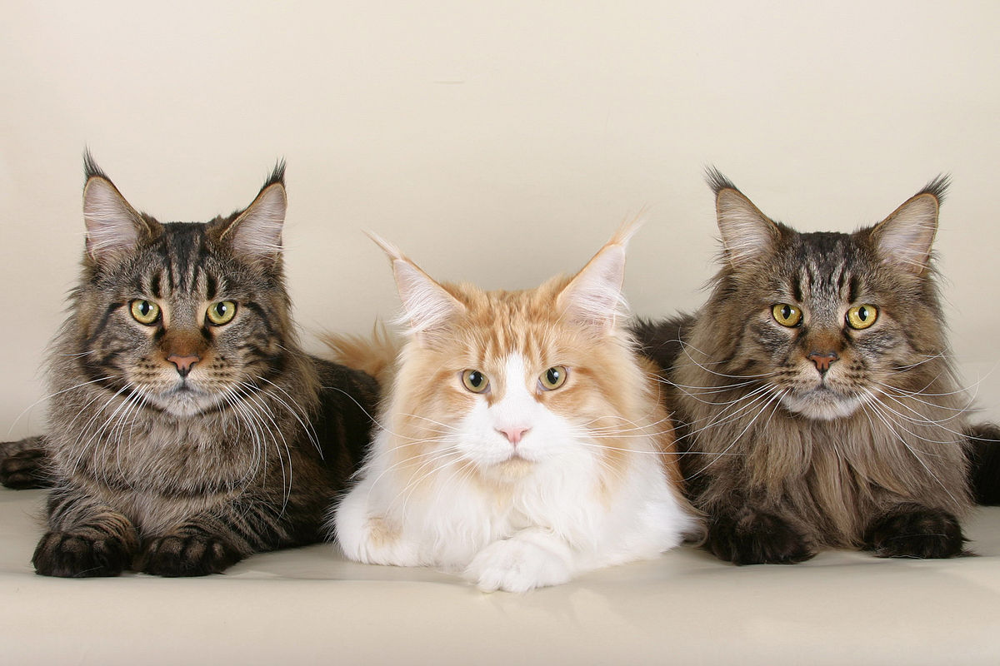

# Почему вам стоит завести кота?

## Фото



## Много плюсов

1. Раз
2. Два
3. Три

### Код(кот!)

```python
def benefits_of_cat():
    """
    Возвращает список основных преимуществ заведения кота.
    """
    return ["Улучшение настроения", "Снижение стресса", "Надёжная компания"]
```

| Преимущество           | Описание                                    |
|------------------------|---------------------------------------------|
| Улучшение настроения   | Кошки дарят радость и позитивный настрой    |
| Снижение стресса       | Общение с кошкой помогает расслабиться      |
| Надёжная компания      | Кот всегда рядом, когда вы дома             |


